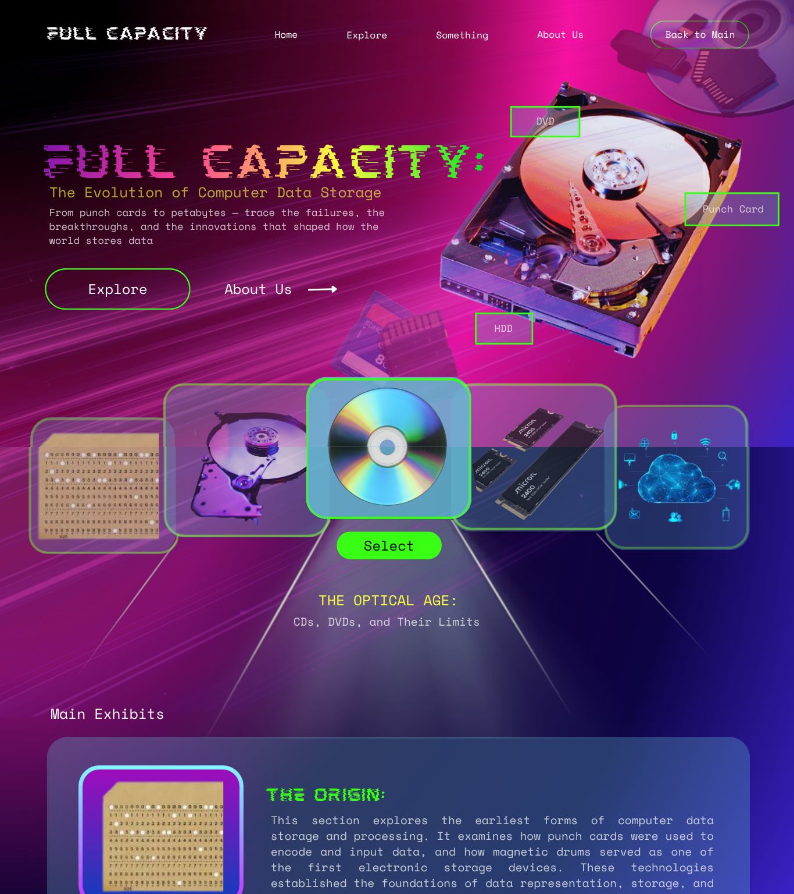
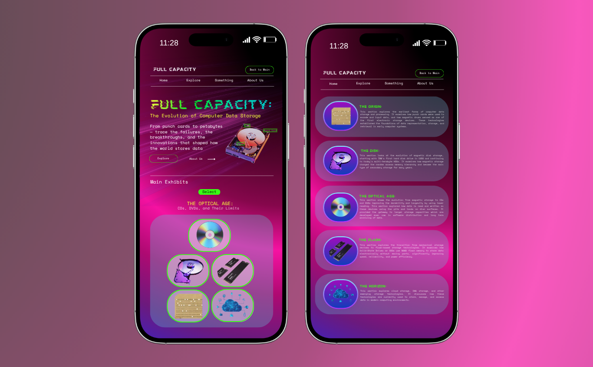
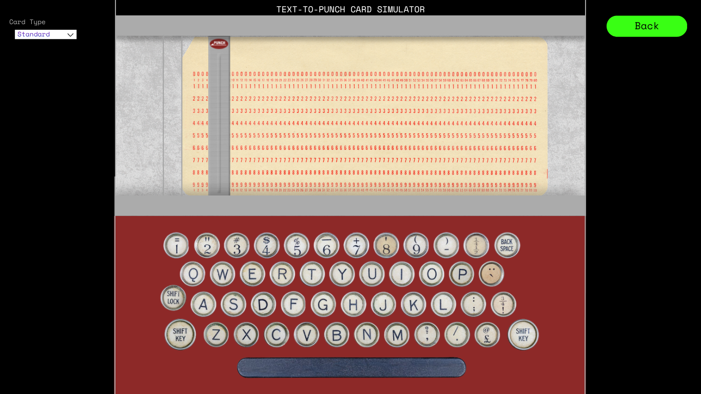
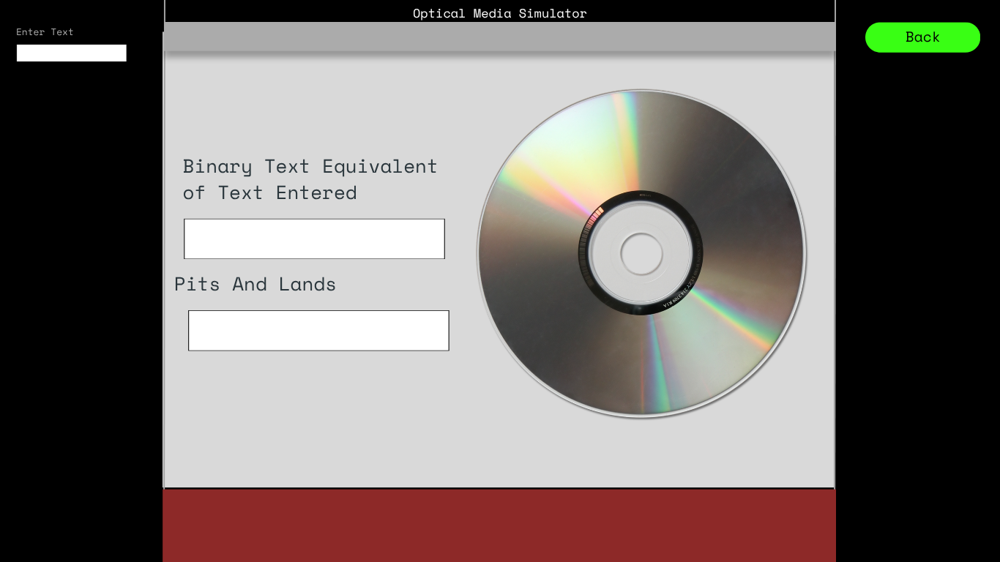
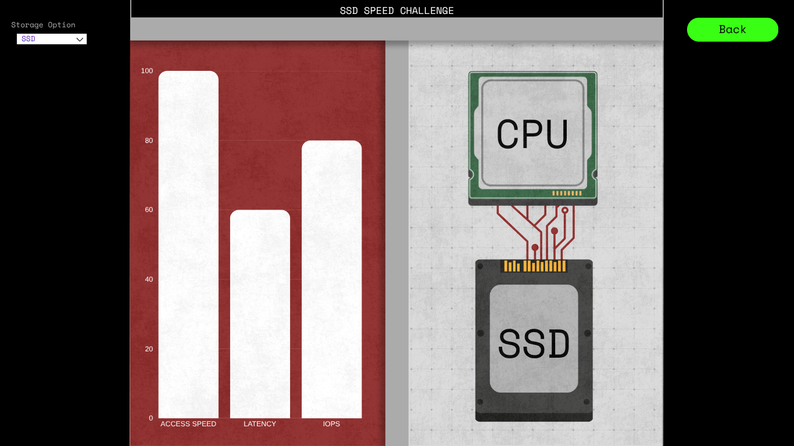
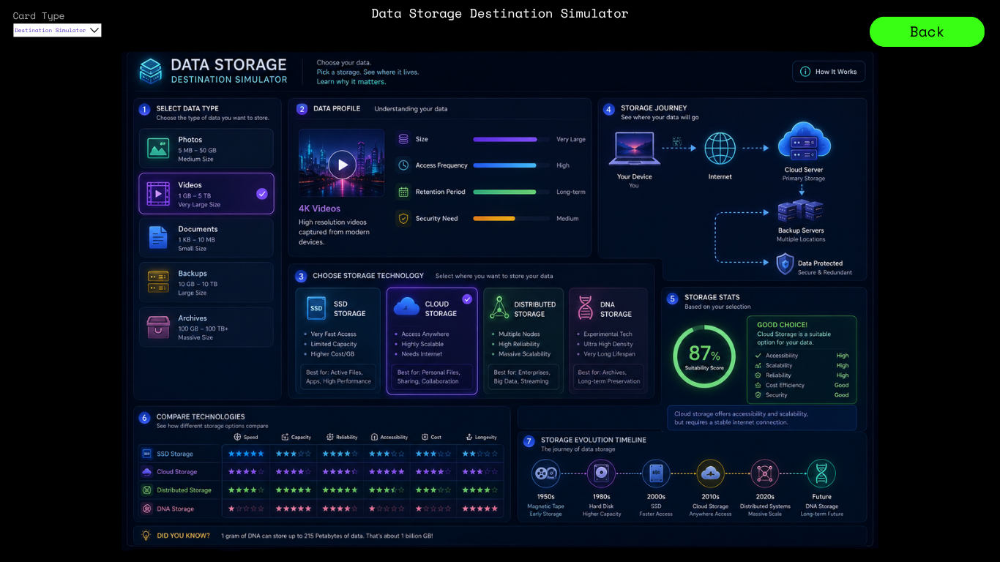
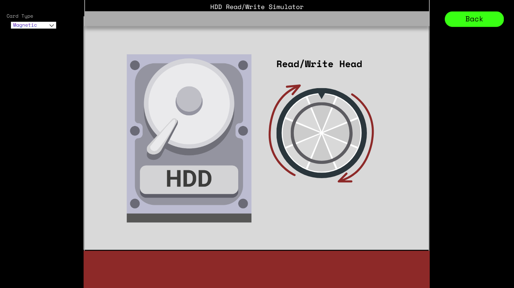

**De La Salle University – Manila**

---

# Full Capacity: The Evolution of Computer Data Storage

In Partial Fulfillment of the Course Requirements for

**INTRODUCTION TO COMPUTER ORGANIZATION AND ARCHITECTURE 2 (CSARCH2)**
3rd Term, A.Y. 2025–2026

---

**Submitted by Group 7 [S01]:**

- GALICIA, Lance Krystofer A.
- KE, Xan Luo C.
- MOJICA, Maurienne Marie M.
- PARADO, Sky Hannah G.
- YAMSUAN, Rhian Claire V.

**Submitted to:** Roger Luis Uy

**Submitted on:** June 06, 2026

---

## I. VIRTUAL EXHIBIT PLAN

This section outlines the conceptual framework of the virtual exhibit. Each chapter is designed to guide visitors through a chronological and technical journey of computer data storage evolution.

### A. Introduction

The chosen topic covers the Evolution of Computer Data Storage — specifically how data storage has progressed from primitive mechanical media to the ultra-fast, high-capacity solutions of modern computing. It examines the advancement of storage hardware, from magnetic drums and punch cards to solid-state drives and NVMe, and how each technological leap directly influenced computer architecture, memory hierarchy, and system performance.

It will cover the following situations as chapters in pairs — the problems and the given improvements in storage evolution:

1. The Origin: Punch Cards and Magnetic Drums
2. The Disk: Magnetic Storage and HDDs
3. The Optical Age: CDs, DVDs, and Their Limits
4. The Flash: SSDs, NAND, and NVMe
5. The Horizon: Cloud, DNA, and Emerging Storage

---

### B. Main Exhibit

#### The Origin: Punch Cards and Magnetic Drums

**Description:** This section explores the earliest forms of computer data storage and processing. It examines how punch cards were used to encode and input data, and how magnetic drums served as one of the first electronic storage devices. These technologies established the foundations of data representation, storage, and retrieval in early computer systems.

**Key Concepts:**
- **Punch card data encoding and processing** *(Revised)* [Revision Notes](%5BREVISION%20NOTES%5D%20%5BCSARCH2%5D%20S01%20Group%207%20-%20Case%20Study%20Project%20%232%20Proposal.pdf)
    - Explains how information was represented using holes punched into cards, allowing computers to read and process data and instructions.
- **Batch Processing Systems** *(Revised)*
    - Describes how jobs were grouped together and processed automatically in sequence without direct user interaction.
- **Magnetic drum memory operations** *(Revised)*
    - Covers how magnetic drums stored data on a rotating surface and how read/write heads accessed information as the drum spun. 
- **Sequential data access** *(Revised)*
    - Explains how data was stored and retrieved in a fixed order, requiring earlier records to be read before reaching the desired data.
- **Early computer input and storage methods** *(Revised)*
    - Introduces the use of punch cards, paper tape, and magnetic drums as the primary methods for entering, storing, and retrieving data in early computers. 
- **Foundations of digital data storage** *(Revised)*
    - Connects these early technologies to modern storage systems by showing how they established the basic principles of digital data encoding, storage, and retrieval.

---

#### The Disk: Magnetic Storage and HDDs

**Description:** This section looks at the evolution of magnetic disk storage, starting with IBM's first hard disk drive in 1956 and continuing to today's multi-terabyte HDDs. It examines how magnetic storage changed the random access memory hierarchy and became the main type of secondary storage for many years.

**Key Concepts:**
- Magnetic recording principles *(Revised)* [Revision Notes](%5BREVISION%20NOTES%5D%20%5BCSARCH2%5D%20S01%20Group%207%20-%20Case%20Study%20Project%20%232%20Proposal.pdf)
    - Covers how data is stored and retrieved using magnetic fields, and how read/write heads interact with magnetized surfaces to encode binary information.
- Platters, read/write heads, and actuator arms *(Revised)*
    - Describes the physical components of a hard disk drive, how they work together to access data, and how their design evolved over time.
- Random access vs. sequential access *(Revised)*
    - Explains the difference between random and sequential access, and how HDDs improved upon earlier storage technologies by allowing data to be retrieved in any order.
- Storage capability scaling and areal density *(Revised)*
    - Introduces how manufacturers increased storage capacity over time by packing more data into the same physical space through advances in areal density.
- HDD role in memory hierarchy *(Revised)*
    - Connects hard disk drives to the broader memory hierarchy which describes how HDDs served as the primary form of secondary storage for decades alongside faster but smaller primary memory.

---

#### The Optical Age: CDs, DVDs, and Their Limits

**Description:** This section shows the evolution from magnetic storage to CDs and DVDs, improving durability and longevity by using laser reading. It explores how data is read and written on these devices using the pits and lands on disc surfaces, and how optical media provided the gateway to larger storage capacities used in software distribution and long-term archiving.

**Key Concepts:**
- Optical data storage utilizing lasers *(Revised)* [Revision Notes](%5BREVISION%20NOTES%5D%20%5BCSARCH2%5D%20S01%20Group%207%20-%20Case%20Study%20Project%20%232%20Proposal.pdf)
    - Covers how lasers are used to read and write data for optical data.
    - Understand how the properties of light enable data to be saved from the reflective surfaces.
- CD and DVD data encoding and retrieval *(Revised)*
    - Describes how different types of media such as audio, video, and digital data are encoded onto CDs and DVDs.
    - Know how the data reading process translates physical features into usable information digitally.
- Pits and Lands as Binary Data Representation *(Revised)*
    - Explains how the pits and flat lands on the disc represent binary 0s and 1s.
- Digital Media Distribution and Archival Storage *(Revised)*
    - Explores how discs became the preferred format for distributing media.
    - How their durability and standardization made them suitable for long-term archives.
- Offline/Tertiary Storage and Reimagination of Storage *(Revised)*
    - Connects optical media to the part it played in the storage hierarchy for offline storage.
    - Know how its limitations and strengths inspired more innovative ideas on how data could be preserved and accessed beyond primary and secondary memory.

---

#### The Flash: SSDs, NAND, and NVMe

**Description:** This section explores the transition from mechanical storage devices to flash-based storage technologies. It examines how Solid-State Drives (SSDs) use NAND flash memory to store data electronically without moving parts, significantly improving speed, reliability, and power efficiency. The section also discusses the development of NVMe (Non-Volatile Memory Express), a modern storage interface designed to fully utilize the performance potential of flash memory by communicating directly with the system through high-speed PCIe connections.

**Key Concepts:**
- NAND Flash Memory Architecture *(Revised)* [Revision Notes](%5BREVISION%20NOTES%5D%20%5BCSARCH2%5D%20S01%20Group%207%20-%20Case%20Study%20Project%20%232%20Proposal.pdf)
    - Explains the internal structure of NAND flash memory, including memory cells, pages, and blocks, and how electrical charges are used to represent binary data in non-volatile forms.
- Solid-State Drives (SSDs) *(Revised)*
    - Describes how SSDs use flash memory chips, controllers, and firmware to store and manage data electronically, eliminating the mechanical limitations of traditional hard disk drives.
- Non-Volatile Storage *(Revised)*
    - Covers the concept of storage that retains data even when power is removed, highlighting its importance in modern computing systems and long-term data preservation.
- Wear Leveling and Flash Memory Lifespan *(Revised)*
    - Introduces the limitations of NAND flash cells, which can only endure a finite number of write cycles, and explains how wear-leveling algorithms distribute writes evenly to extend drive longevity.
- SATA vs. NVMe Interfaces *(Revised)*
    - Compare the two major SSD interfaces, showing how SATA SSDs remain constrained by legacy hard drive communication standards while NVMe SSDs are designed to fully utilize the speed of flash storage.
- PCI Express (PCIe) Communication *(Revised)*
    - Explains how NVMe drives communicate directly through PCIe lanes, reducing protocol overhead and enabling much higher bandwidth than traditional storage interfaces.
- Storage Performance and Latency *(Revised)*
    - Examines the factors that affect storage speed, including access time, throughput, and latency, and how SSDs dramatically reduce delays compared to mechanical drives.
- Input/Output Operations Per Second (IOPS) *(Revised)*
    - Covers the measurement of storage responsiveness by evaluating how many read and write operations a device can perform within a second, a key metric in enterprise and high-performance computing environments.
- Modern Memory Hierarchy *(Revised)*
    - Connects SSDs and NVMe storage to the broader memory hierarchy, illustrating how advances in flash technology have narrowed the performance gap between secondary storage and primary memory while supporting the growing demands of modern applications, cloud computing, and data-intensive workloads.

---

#### The Horizon: Cloud, DNA, and Emerging Storage

**Description:** This section explores cloud storage, DNA storage, and other emerging storage technologies. It discusses how these technologies are currently used to store, manage, and access data in modern computing environments.

**Key Concepts:**
- Cloud Storage Architecture *(Revised)* [Revision Notes](%5BREVISION%20NOTES%5D%20%5BCSARCH2%5D%20S01%20Group%207%20-%20Case%20Study%20Project%20%232%20Proposal.pdf)
    - Explains how cloud storage works at a high level, including how data is sent, stored, and retrieved across remote servers through the internet.
- Data Centers *(Revised)*
    - Describes what data centers are, how they are physically structured, and how they power and cool thousands of servers to keep data available 24/7.
- Distributed Storage Systems and Data Reliability *(Revised)*
    - Introduces concepts such as RAID, data replication, sharding, backup, and redundancy, explaining how large-scale storage systems distribute and duplicate data across multiple servers and locations to improve reliability, availability, and performance.
- DNA Storage *(Revised)*
    - Discusses how biological DNA can be used to encode digital data, its current state of research, its massive storage potential, and the challenges that still prevent real-world adoption.
- Cloud Storage and Scalability *(Revised)*
    - Explains how cloud storage enables users and organizations to store and access data through remote servers while easily scaling storage capacity to meet growing data demands.
- Data Access and Retrieval *(Revised)*
    - Explains how stored data is located, accessed, and retrieved efficiently through indexing, caching, networking, and storage management techniques.
- Emerging Storage Technologies *(Revised)*
    - Briefly covers next-generation storage ideas such as holographic storage and neuromorphic storage, giving visitors a glimpse of what the future of data storage may look like.

---

### C. Conclusion

The overall goal is to understand the design and limitations of each breakthrough. The need for storage for both regular functions and long-term memory have shaped the technology that we use today. It is also important to understand which aspects of each technology were carried forward or dropped, and how this shaped our modern storage through both hardware and software.

Through the generations, we can observe how memory hierarchy, I/O systems, and performance bottlenecks evolve — showing how important computer architecture is in optimizing systems and improving performance and efficiency, not just locally but globally.

By the end of the exhibit, visitors will be able to:
- Explain how storage technologies evolved from early physical media to modern and emerging systems
- Understand the architectural principles and trade-offs behind each innovation
- Recognize how these developments shaped today's storage hierarchy and computer systems

---

## II. TECHNICAL STACK PLAN

| Component | Technology | Version | Application & Justification |
|-----------|------------|---------|------------------------------|
| Runtime | Node.js | v26.0.0 | Running Astro and building tools. |
| Framework | Astro | v6.0 | Builds a website with interactive parts. |
| Content | MDX | @astrojs/mdx | Allows Markdown content with diagrams and buttons. |
| UI Components | React | v19.x | Builds interactive elements like dynamic content, diagrams, and pop ups. |
| Styling | Tailwind CSS | v4.x | For ready-made classes for design purposes. |
| Version Control | GitHub | – | For easy collaboration and version tracking. |

---

## III. ELEMENT PLAN

This section describes the interactive components integrated into the exhibit to enhance visitor engagement and reinforce key concepts. Each element is designed to translate abstract technical concepts into hands-on, visual experiences accessible to visitors regardless of their technical background.

---

### 1. Text-to-Punch Card Simulator

This interactive simulator allows visitors to enter text and see how it would be represented on a punch card. It helps visitors understand how early computers stored and processed data using punched holes as a form of data encoding.

**Interactive Elements/Features:**
- Text input field for user-entered data
- Real-time punch card visualization

**User Interaction Flow:**
1. The visitor enters a character into the input field.
2. The simulator immediately punches the corresponding holes on the virtual punch card.
3. As additional characters are entered, new punch patterns are added to the card in real time.
4. The visitor observes how each character is encoded and stored on a punch card.
5. The visitor explores how punch cards were used for data input and storage in early computer systems.

---

### 2. HDD Read/Write Simulator

This interactive simulator allows visitors to visualize how data is stored and retrieved in a hard disk drive using platters, tracks, and sectors. It helps visitors understand how mechanical movement and magnetic storage enable random access in HDDs.

**Interactive Elements/Features:**
- Interactive rotating platter animation
- Click-to-select data sectors on the disk
- Read/write head movement visualization
- Highlighted track, sector, and data location display

**User Interaction Flow:**
1. The visitor selects a data block on the virtual disk.
2. The platter rotates to align the correct track under the read/write head.
3. The read/write head moves across the actuator arm to the selected position.
4. The target sector is highlighted to show where data is stored or retrieved.
5. The visitor observes how HDDs locate and access data using mechanical movement.

---

### 3. Optical Pit and Land Encoder Simulator

This interactive simulator allows visitors to convert text into binary and visualize how CDs and DVDs store data using pits (0) and lands (1). It helps users understand how optical media encodes digital information through physical surface patterns.

**Interactive Elements/Features:**
- Text-to-binary conversion display
- Pit and land visualization on disc tracks
- Laser reading simulation
- Highlight of binary-to-physical mapping

**User Interaction Flow:**
1. The visitor enters text into the input field.
2. The simulator converts the text into binary form.
3. Binary values are mapped into pits and lands on a disc track.
4. A laser animation reads the surface pattern.
5. The visitor observes how binary data is physically represented on optical media.

---

### 4. SSD Speed Challenge

This interactive comparison allows visitors to explore how flash-based storage technologies improved data access speeds compared to traditional hard disk drives. By comparing HDDs, SATA SSDs, and NVMe SSDs, visitors learn how advances in storage architecture, NAND flash memory, and PCIe communication reduced latency and increased overall system performance.

**Interactive Elements/Features:**
- Storage device selector (HDD, SATA SSD, NVMe SSD)
- Real-time performance comparison display
- Interactive visual showing data travel paths from storage to the CPU
- Key statistics display (latency, speed, and IOPS)
- Explanations of SATA and NVMe communication methods

**User Interaction Flow:**
1. The visitor selects a storage technology from the available options: HDD, SATA SSD, or NVMe SSD.
2. The exhibit displays a visual representation of how data travels from the storage device to the processor.
3. Performance metrics such as access speed, latency, and IOPS are displayed and updated based on the selected technology.
4. The visitor switches between storage technologies to compare their performance characteristics.
5. The exhibit highlights how NAND flash memory eliminates mechanical delays and how NVMe utilizes PCIe connections to achieve higher speeds than SATA-based storage.
6. The visitor gains an understanding of why SSDs and NVMe drives became the preferred storage solutions in modern computer systems.

---

### 5. Data Storage Destination Simulator

This interactive simulator allows visitors to choose different types of data and see where they would be stored using modern storage technologies. It helps visitors understand the differences between local storage, cloud storage, distributed systems, and emerging technologies such as DNA storage.

**Interactive Elements/Features:**
- Selectable data types (photos, videos, documents, backups, archives)
- Interactive storage technology cards
- Explanation of storage location, scalability, and accessibility

**User Interaction Flow:**
1. The visitor selects a type of data from a list.
2. The simulator displays several storage options such as SSD, cloud storage, distributed storage, and DNA storage.
3. The visitor selects a storage technology.
4. The simulator explains how the selected technology stores the data and highlights its advantages and limitations.
5. The visitor compares different storage methods and learns why certain technologies are better suited for specific use cases.

---

### Mobile Responsiveness

All interactive components are designed to be fully responsive and optimized for mobile devices. Layouts automatically adjust to vertical stacking for smaller screens, ensuring readability and usability. Touch-based interactions replace hover and click-based controls, with simplified animations to maintain smooth performance. Visual elements such as diagrams, simulations, and comparison panels are scaled appropriately to fit different screen sizes without losing clarity or functionality. Interactive buttons, input fields, and selection controls are sized for touch navigation, allowing visitors to easily engage with exhibit content on phones and tablets.

---

## IV. TENTATIVE STYLE GUIDE SNAPSHOT

This section presents the preliminary visual and design direction for the virtual exhibit. The specifications outlined below serve as a reference for maintaining consistency in aesthetics, typography, and layout throughout the development process.

**Table 1.** Tentative Style Guide for "Full Capacity" Virtual Exhibit

| Property | Details |
|----------|---------|
| **Theme** | Cyberpunk Archive |
| **Color Palette** |  |
| **Typography** | Heading Font: Mokoto Glitch (Desktop) / Body Font: Space Mono |
| **Layout** | **Landing Page** – Introduces the title with visuals of storage devices and a brief exhibit overview. **Navigation** – Provides access to Home, Explore, and About Us. **Content Sections** – Organized into exhibit sections covering punch cards, HDDs, optical media, RAM, and cloud storage with descriptions and visuals. **Interactive Area** – Users select storage device icons or cards to activate interactive components. **Footer** – Contains navigation links, exhibit information, and credits. |
| **Accessibility** | **Contrast** – High contrast between bright elements and the dark pink-purple background. **Responsive Design** – Desktop and mobile layouts with rearranged content for smaller screens. **Keyboard Navigation** – Buttons and exhibit cards accessible via keyboard controls. **Alt Text** – Descriptive alt text on all storage device and exhibit images. |

---

## Appendices *(Revised)* [Revision Notes](%5BREVISION%20NOTES%5D%20%5BCSARCH2%5D%20S01%20Group%207%20-%20Case%20Study%20Project%20%232%20Proposal.pdf)

**Figure 1.** Desktop Layout Mockup of the "Full Capacity" Virtual Exhibit Landing Page

---

**Figure 2.** Mobile Layout Mockup of the "Full Capacity" Virtual Exhibit Landing Page

---

**Figure 3.** Mockup of Interactive Element 1: Text-to-Punch Card Simulator

---

**Figure 4.** Mockup of Interactive Element 2: Optical Media Presentation

---

**Figure 5.** Mockup of Interactive Element 3: SSD Speed Challenge

---

**Figure 6.** Mockup of Interactive Element 4: Data Storage Destination Simulator

---

**Figure 7.** Mockup of Interactive Element 5: HDD Read/Write Simulator

---

## V. AI USAGE DECLARATION

The group utilized AI assistants, namely Claude and ChatGPT, to support the writing and preparation of this proposal. Specifically, the AI was used to assist in formatting and structuring the document to provide guidance on what content should be included in each section, and checking grammar and writing clarity throughout the paper. All AI-generated suggestions were reviewed, revised, and approved by the group to ensure accuracy and alignment with the project's goals. The core ideas, technical decisions, and overall direction of the project remain the original work of the group.